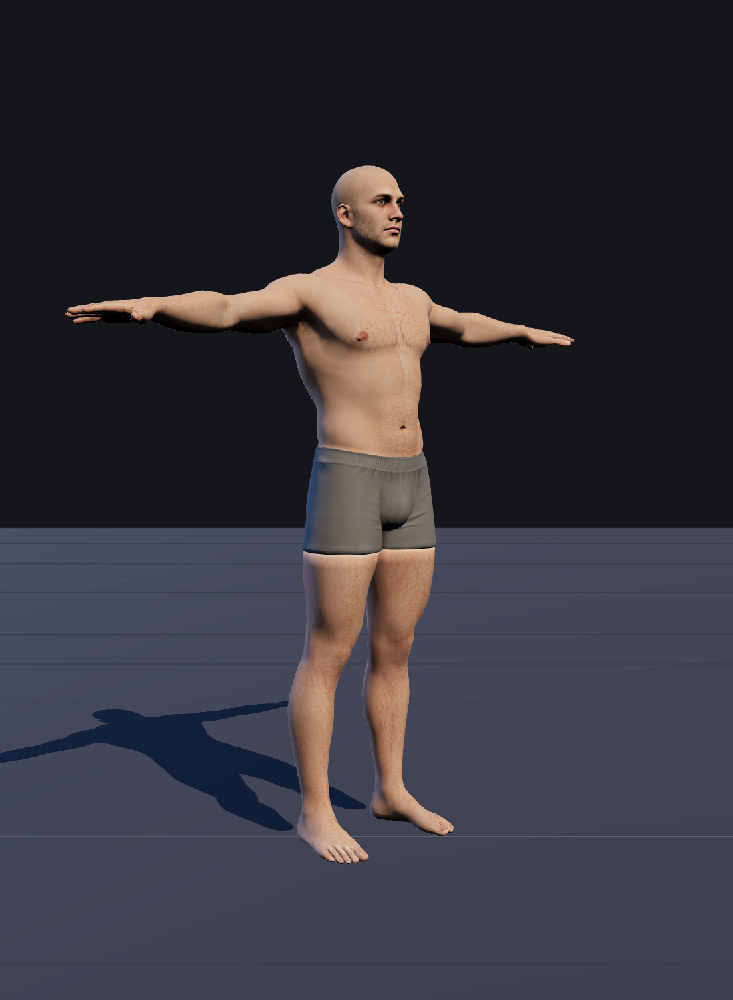
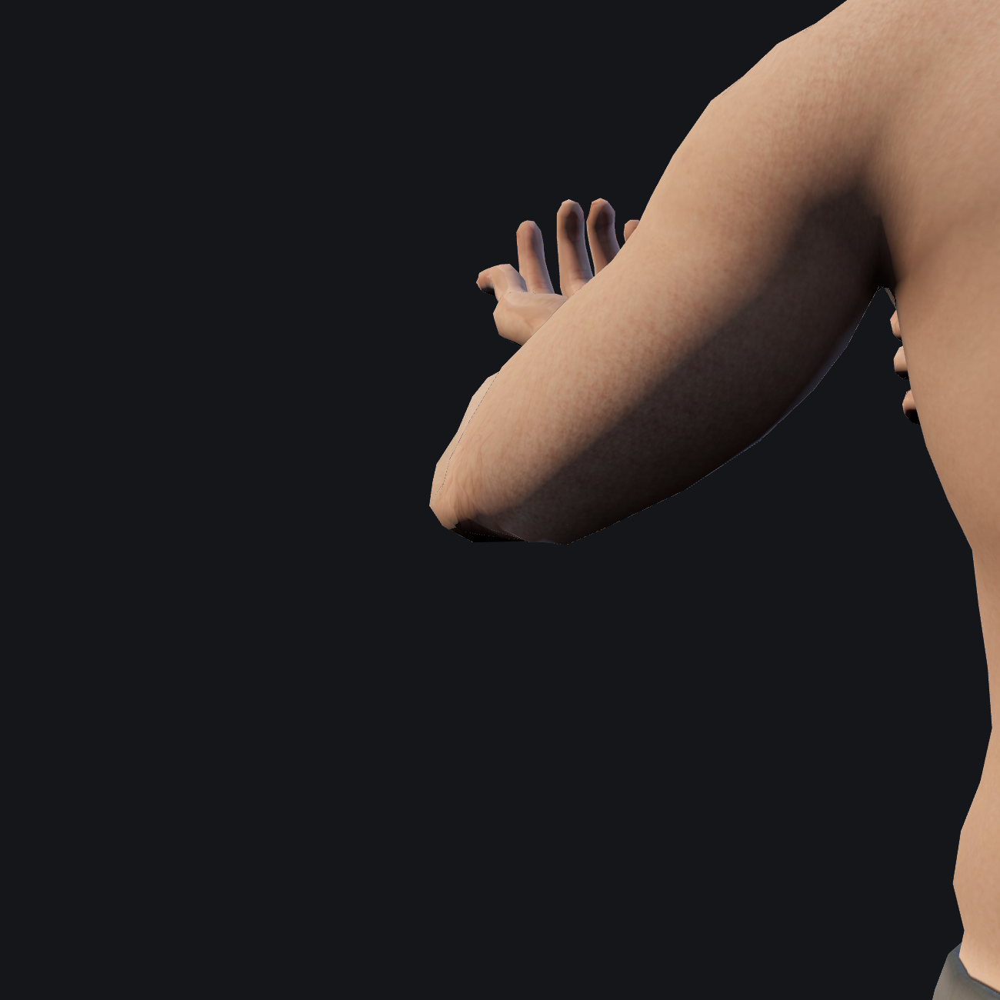
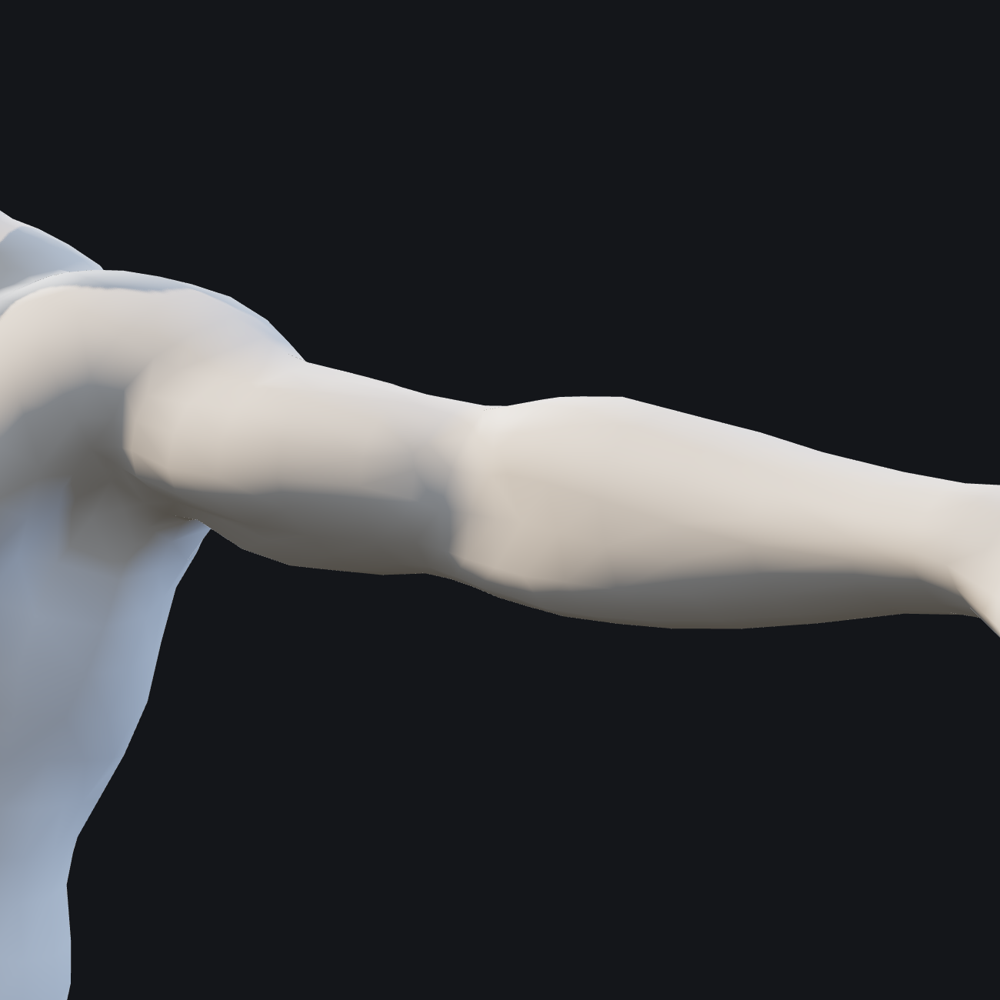
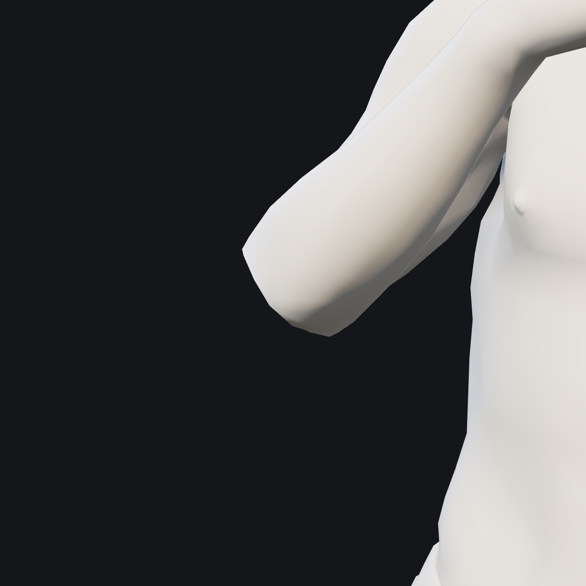
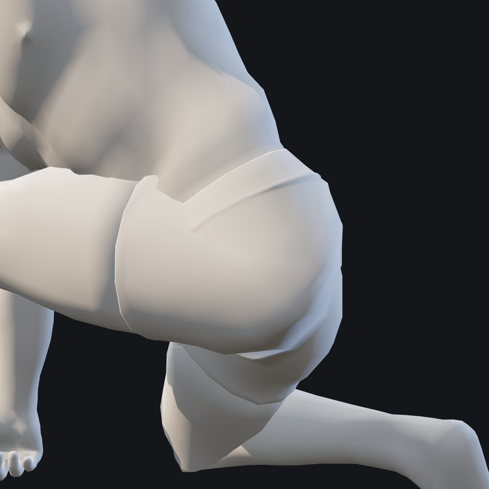
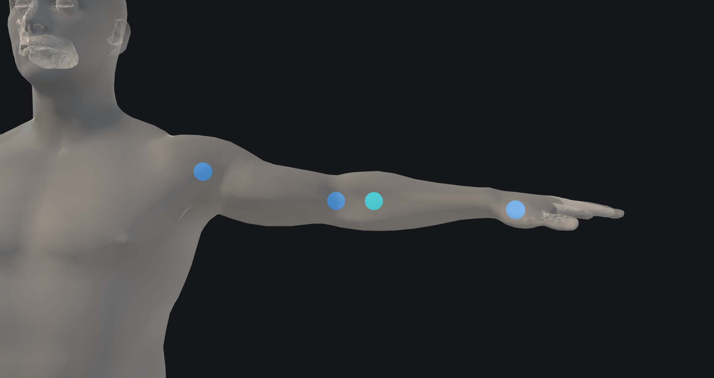
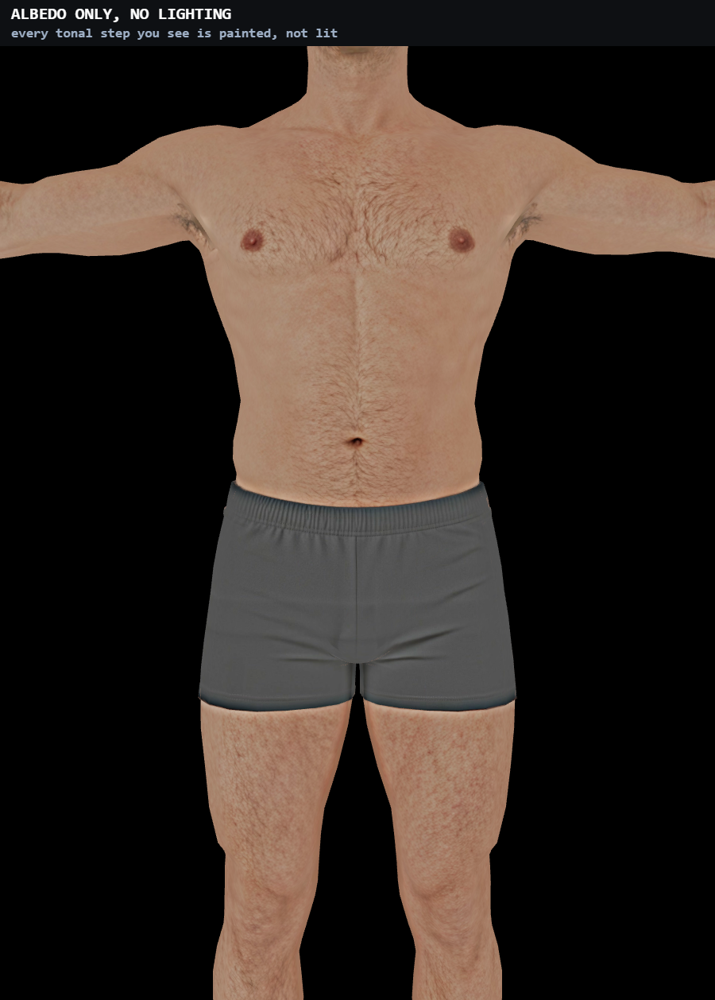

# Honest critique — `human-foundation-pilot-runtime-4k.glb`

**Issue #458 · SoulDrifter · model review**

Asset: `public/assets/3d/characters/human-foundation-pilot/human-foundation-pilot-runtime-4k.glb`
2,404,872 bytes · sha256 `b86f7378ada29ff11e0fbc030d438fe241b8d4a74c47afd37cc8aced28c5ff81`
15,342 vertices · 15,894 triangles · 65 joints · 1 skinned mesh · 1 material · 0 animations

The renders embedded below are committed beside this document in
`human-model-critique/`. The full evidence set they were selected from - 191 files
covering turnarounds, wireframes, UV and texel density, texture channels, silhouettes
and 69 deformation frames - stays in the review lane at
`H:/CodexData/.codex/artifacts/issue-458-motion-composer-v1/out/model-critique/`,
which is outside this repository.

---

## Verdict

**No. This is not good enough to be the player body of this game.** It is serviceable as a
motion-test mannequin in the Motion Forge — which is the only job it is currently doing well
— but it cannot become the character the player inhabits, and no amount of weight painting
will change that.

**The single thing most wrong with it is that it was never rebuilt.** This is the raw
generator output: the material is still named `tripo_079291c6_872f_4a79_8d7e_51aedb0891a6`,
the texture is still named `human-masculine-athletic-muscular-basecolor-4k`, and every
serious defect below is a symptom of that one fact. No twist joints, 39% of the triangle
budget in a head that is 91 pixels tall in play, 998 UV islands with no locality, one
base-colour channel and no tangents, and sculpted underwear welded into the same mesh and
the same atlas as the skin — these are not five independent mistakes. They are what a
photogrammetry base scan looks like when it is dropped into a game without a rebuild pass.
Every other body in this project has had that pass. The Breachlings went through a
glTF-Transform rebuild; the Wayfarer Warden has 26 meshes, hand-built topology and a full
base + metallicRoughness + normal set. The player body has 2.1× fewer triangles than the
base Breachling it fights, and its *body* — excluding the head — is 9,776 triangles against
that Breachling's 33,242.

The most urgent *repairable* defect is the total absence of twist distribution in the rig,
because it fires on every weapon swing at the exact camera you review at. The
*disqualifying* defect is the welded garment, because it means this body can never be
dressed or armoured.

*This is what the review lab shows: a bald man in grey boxer briefs. The briefs are geometry
welded into the single mesh, not a texture you can swap.*

---

## Ranked findings

Ranked by what actually costs this game something, not by how easy each is to describe.

| # | Finding | Severity | Proof | Cost to fix |
|---|---|---|---|---|
| 1 | **No twist joints anywhere.** Forearm roll collapses the arm to **0.208** of its bind cross-section (105.1 → 47.9 mm effective diameter). Regex over all 65 joint names for `twist\|roll\|helper\|corrective` returns **0**. | **Critical** | `crit-girth.json` → `forearmL_twist`, worst ring ratio 0.208 at `ProRifle__RunLeft` t=0.229; bind-pose control ratio 1.000. Render below. | ~1 day. 2 twist bones per arm + thigh, weight pass, procedural driver. **The 400 clips need no edit.** |
| 2 | **Underwear is welded into the mesh and the atlas.** 1 material, 1 primitive, garment = 24.1% of covered texels. Hem is a density ring at **28.7× the median band density**. A 987 mm open rim sits inside the briefs. | **Critical (blocking)** | 148 boundary edges / 8 loops, largest 30 verts × 987 mm at y=1.182 m (verified independently). `01-turnaround/02-clay-side.png` shows the hem step with no texture on. | Re-sculpt pelvis + re-close, or re-source the body. Days. Not a patch. |
| 3 | **Linear-blend skinning, no correctives — the mesh passes through itself at flex.** Knee 163 intersecting triangle pairs (15.2%), hip 266, elbow 65. Elbow section falls to **0.258**. | **High** | `crit-penetrate.json`, with a **bind-pose control at 0 pairs** and a poser validated to 0.00000 mm round-trip drift. | Pose-driven correctives at 6–8 joints. Days of authoring, no retopo. |
| 4 | **The triangle budget is inverted.** Head **6,118 tris (38.5%)** for **7.0%** of surface area, rendering at **91 px** tall. Shoulders get **209**. Thighs are the lowest density on the body at 1,543 tris/m². | **High** | My own region budget: head 27,363 tris/m² vs torso 2,727, shoulders 2,294, thighs 1,543. Screen size computed from `weapon-lab.js:241` (fov 40, cam (0,1.3,4.2)). | Retopo + re-bake. Travels with #6. |
| 5 | **Base colour only, and no `TANGENT` to add anything to it.** `normalTexture`, `metallicRoughnessTexture`, `occlusionTexture`, `emissiveTexture` all null. `roughnessFactor` **0.968 constant over skin, lips, eyes and fabric**. | **High** | Read directly from the GLB JSON. `TANGENT` absent from `POSITION, NORMAL, TEXCOORD_0, JOINTS_0, WEIGHTS_0`. | Bake normal + roughness + AO, bake tangents. ~1 day, and it buys more than any triangle would. |
| 6 | **998 UV islands with no locality.** The head's triangles are scattered over essentially the whole 4096² map — head UV bbox (4,4)→(3965,4050). **There is no face island.** | **Medium-High** | `04-uv-and-texel/10-checker-front.png` — near-square cells (distortion is genuinely low) that never stay continuous. 63.96% coverage; 232 islands under 2 texels at the mip the lab samples. | Re-unwrap + re-bake. Half a day of unwrapping. Enabling step for #4 and #5. |
| 7 | **No facial rig and no eyeballs.** 65 joints, no jaw, no eye, no tongue, no morph targets. `Head` is one rigid bone owning 5,977 vertices; 3,589 of the mesh's 4,150 single-influence vertices are 100% `Head`. The eyes are painted flat onto the surface. | **Medium** | Joint-name regex for `jaw\|eye\|tongue` returns **NONE**. `02-close-range/05-face-clay-front.png` — with texture off the eye is a dished slit. | Eyeball spheres + lids + 2 joints ≈ 1 day, independent of everything else. Best perceived-quality-per-hour on the list. |
| 8 | **2.06 m contradicts the game's own player constants.** `TARGET_HEIGHT_METERS = 2.06`, but `BREACHLING_SPIT_PLAYER_HEIGHT_METERS = 1.8` and `BREACHLING_SPIT_TARGET_HEIGHT_METERS = 1.15`. | **Medium — this is a bug** | Spine2 (chest) measures **1.5516 m**. Acid is aimed 40 cm below the chest, at hip height. The top 26 cm of the body sits outside the 1.8 m hit capsule. Breachlings are 1.025–1.325 m. | One constant, plus re-tuning nine weapon grips. See recommendation. |
| 9 | **Forearm 30% longer than the upper arm.** Elbow at **43.8%** of the shoulder-to-wrist chain; a human is 55–57%. Identical on both sides, so systematic. | **Low-Medium** | Upper arm 266.9 mm, forearm 347.2 mm, ratio 1.301. **This is the sculpt, not the rig** — see resolution 4. | Leave it. Moving the bone would break every hand-contact pose for a cosmetic gain. |
| 10 | **The 4K base colour is ~2 mip levels oversized.** 1,488,748 bytes = **61.9% of the whole GLB**; 85.3 MB VRAM with mips. At the Motion Forge camera it is **5.19× oversampled**. | **Low** | `09-materials/01-budget-gameplay-front.png` renders 4096/2048/1024/512 on the game's own rig — indistinguishable. 4096→2048 costs PSNR 40.8–43.0 dB. | One export setting. Do it *after* the re-unwrap. |
| 11 | **Hygiene.** 15 non-manifold edges; 8 open holes (6 in the face); `doubleSided: true` on a closed opaque body; `KHR_materials_specular.specularColorFactor` = **1.6**, outside the extension's own 0–1 range and 2.3× human skin. | **Low** | All read directly from the GLB. Holes: `09-holes/05-mouth-below.png`, `09-holes/03-eye-left.png`. | An hour, collectively. |

### The proof for #1

`ProRifle__RunLeft` at t=0.229, forearm 126.5° from bind, in `mode=shaded` — exactly what
the lab shows you. The forearm has flattened into a faceted paddle with a hard crease down
its whole length, and it pinches to a blunt point. Compare the same arm at rest:

The measured cause is that the forearm rotates as one rigid tube. Median twist along the
shaft from t=0.14 to t=0.94 reads 135.0°, 138.8°, 140.0°, 140.9°, 141.4°, 141.2°, 145.5°,
149.7° — flat. The entire ~140° is absorbed in an 84 mm window straddling the elbow.

This body grips a greatsword, shortsword, staff, mace, bow, wand, ritual knife and daggers.
Every sword, bow and staff clip pronates the forearm. This is on screen during every attack
you review.

### The proof for #3

At full flex the elbow's outer silhouette is a 6–8 sided polygon with ~30 mm facets, and 65
triangle pairs of the upper arm and forearm occupy the same space. The bind-pose control for
the same test is 0 pairs, so this is deformation, not a broken mesh.

The deep lunge is the worst case — 266 intersecting pairs — and it also tears the garment:
the waistband separates into a floating shard with a hard dark seam.

---

## Where the four inspections disagreed, and who was right

I re-measured every contested fact rather than printing both views.

**1. Head height — 6.89 heads tall or 7.98?**
`anthropometry.json` reports `headHeightChinToCrown_approx: 0.2989` → 6.89 heads, and one
inspection built a whole "stocky sculpt blown up to giant scale" argument on it. **It is
wrong.** I took the mid-sagittal profile (|z| < 8 mm) and walked it: the chin protrudes to
x = 0.117–0.120 down to y = 1.808, then collapses to 0.086 at y = 1.793 as the profile
recedes into the throat. **The chin is at ≈1.80 m, the head is ≈260 mm, and the body is 7.9
heads tall** — top of the heroic band, not stocky. The inspection that measured 258 mm
against a rendered ruler was right. *Consequence: the "stocky sculpt" reading is retracted;
the proportions are correct and only the absolute scale is in question (#8).*

**2. Chest-to-waist — 1.197, 1.235 or 1.292?**
All three inspections measured at different heights and one confounded girth with breadth.
The trap is that **arm surface reaches down to y = 1.532 m**, so any section taken at or
above that height silently includes deltoid mass. Taking closed contour loops and stopping
below the deltoid: **waist 0.9804 m at y=1.23, chest 1.2835 m at y=1.52 → chest/waist =
1.31.** At 1.75 m stature that is a 42.9 in chest on a 32.8 in waist. The inspection
claiming 1.197 measured the chest ~5 cm too low on the torso and concluded "average adult
male"; **that conclusion is wrong.** 1.31 sits at the bottom edge of the athletic band.

**3. Is the shoulder the worst region or the one joint that doesn't fail?** *Both, and they
are not the same question.* By build quality the shoulder is the poorest region on the body:
**209 triangles for 0.0911 m²**, and 46.1% edge alignment against 66–67% for a ring-built
control. By deformation it is the **best** joint on the body: worst ring holds **0.593** of
its section and there are **zero** intersecting triangle pairs at 180° overhead. The
worst-*deforming* joint is the elbow/forearm (0.258 / 0.208). Ranked table entries #1 and #4
split accordingly — do not conflate them.

**4. Is the elbow bone misplaced, or is the sculpt just oddly proportioned?**
One inspection could not resolve this and said so. It is resolvable with cross-sections
taken **perpendicular to the arm axis** rather than horizontal slabs. The girth profile
descends from the deltoid to a clear local minimum of **319.5 mm at ≈263 mm** from the
shoulder, then rises to a forearm belly of 371 mm at 340 mm — the correct anatomical
signature. **The elbow bone sits at 267 mm, i.e. 4 mm from the sculpted elbow.** The rig is
faithful; the sculpt has a short humerus. The knee is clean at 50.8% of hip-to-ankle.

**5. Are the skin weights broken by cross-leg bleed?**
One inspection reported 679 vertices carrying both `Left*` and `Right*` weight and called it
a permanent stride artefact. The count is exactly right; **the framing is not.** Of the 215
vertices with opposite-side weight above 0.20, the median distance from the midline is
**9 mm** and p90 is 27 mm — that is the crotch centreline, where blending both legs is
correct. Only **14 vertices in the entire mesh** sit more than 50 mm off the midline with
significant opposite-side weight. The named worst case is real (`LeftUpLeg 0.566 /
RightUpLeg 0.406` at y=947 mm, z=−112 mm) but it is a ~14-vertex cluster at the brief hem,
not a systemic defect. **The weights are clean.**

**6. Native height and runtime scale.** The brief's 0.9891 / ×2.0827 is the *bone* span
(`HeadTop_End` → `LeftToe_End`). `human-review-actor.js:350` reads
`TARGET_HEIGHT_METERS / (bounds.max.y - bounds.min.y)` — the **bounding box**. Measured box
height **0.999512**, so the game applies **×2.061006**. Use that figure.

**7. Do the fingers move?** The brief's "45 of 65 joints carry no motion" is true **of the
authored reaction packs only**. In the main library, **279 of 400 clips actually move the
finger joints**, all 30 finger bones carry tracks, and no rig bone is left undriven. The
finger-motion problem belongs to the reaction packs, not to this model.

**8. Open holes.** Two inspections reported "no geometry pathology" having checked only
degenerate triangles. There are **148 boundary edges forming 8 open loops** — I confirmed
the count and every loop position exactly. Six are in the face. They matter little (the
material is `doubleSided`, the head is 91 px) but the mesh is not closed.

**9. Minor corrections.** Max weight-sum error is **1.08 × 10⁻⁷**, not 0.0. Head screen
height is **91 px**, not 106 — the 106 figure used the incorrect 0.2989 head height.
`anthropometry.json`'s `chestWidthMesh` 2.058 m and `shoulderWidthMesh` 1.303 m measure the
T-posed arms, not the torso; biacromial span is 467.3 mm.

---

## What is genuinely good

Short, because padding this section would be dishonest — but these are real and should not
be re-litigated.

- **The skin weights are competently painted.** All 15,342 sums are 1.0 to within
  1.08 × 10⁻⁷, zero negatives, zero hard-cut edges, and **zero single-influence vertices at
  every deforming joint** (shoulder 0/251, elbow 0/176, knee 0/128, wrist 0/335, ankle
  0/140). The 27% global single-influence figure is 3,589 head vertices plus Hips and
  Spine2. Do not blame the weights for findings #1, #3 or #4.
- **The rig and its 400-clip library are a perfectly matched pair.** 65/65 bone names,
  segment proportions agreeing to **0.00–0.04%**, no undriven rig bone, no orphan clip node,
  and zero bone-length drift across all 26,000 position tracks. There is no retargeting
  problem here at all. *This is also what makes replacement cheap — see below.*
- **There is no baked lighting in the albedo.** I expected the opposite. Correlation between
  ray-traced AO openness and base-colour luminance is **r = +0.0101**; deeply occluded
  texels sit at 0.918–1.040× the luminance of open ones, where a baked AO map lands at
  0.5–0.75. Side-light asymmetry over 209,963 mirror-paired texels is +1.77%. This texture
  will not fight your scene. 
- **The surface is bilaterally symmetric** — median 0.17 mm, p99 2.50 mm on a 2.06 m body.
- **Proportions below the neck are right.** 7.9 heads tall, knee at 50.8%, arm span = height,
  leg/height 0.469 (human 0.48), biacromial/height 0.227 (human 0.23). The arm is the single
  outlier.
- **The unwrap has low distortion and uniform density.** p90/p10 = 1.08, median 1,836 px/m,
  near-square checker cells everywhere. Its problem is fragmentation, not stretching — say
  the right thing about it.
- **The JPEG encode is not the problem.** Q ≈ 94, blocking ratio 0.94 (i.e. none measurable),
  gutter fully dilated with exactly 2 near-black texels. The softness is in the source image.
- **The hands are correctly provisioned** for the one camera that frames them
  (`setWeaponHandView`, ~0.65 m at fov 32, where finger triangles are 95 px² each). Fingers
  are separate with 7–10 mm clearance. This is the one part of the budget spent well —
  **do not cut the hands.**
- **The head sculpt is the best-made part of the mesh.** Ear, nose and lip forms are real and
  the density supports them.

---

## Recommendation

**Replace it as the player body. Keep it as the motion-test mannequin until the replacement
lands.**

Fixing this asset into a shippable player character means: re-sculpting the pelvis to remove
a welded garment, retopologising to move ~2,500 triangles out of the head and into the
joints, re-unwrapping from 998 islands to ~15, re-baking the albedo through new UVs, baking
a normal/roughness/AO set, adding tangents, adding twist bones, adding correctives, and
adding a facial rig. At that point nothing of the original survives except the silhouette —
and the silhouette is a photogrammetry scan of an ordinary man, which is not the character
you want anyway.

**Replacement is much cheaper than it looks, and here is the specific reason:** the
animation library is stock Mixamo, the rig is stock Mixamo, and they agree to 0.00–0.04%
with zero drift. **Any Mixamo-compatible humanoid drops straight in and all 400 clips keep
working.** You are not re-authoring animation. Concretely:

- **Cheapest path (~2–4 days):** buy a rigged, clothed game-ready male base (Character
  Creator 4, Daz-to-game, or a Synty/KitBash hero body), export to Mixamo naming, drop in,
  re-tune the nine weapon grips. You get PBR maps, sane topology, separate garment meshes
  and a face rig for the price of the licence.
- **Proper path (~1–2 weeks of character-artist time):** run the same rebuild the Wayfarer
  Warden went through — hand-built topology weighted to the joints, garment and armour as
  separate submeshes, full base + metallicRoughness + normal set, twist bones and
  correctives. Use the current sculpt as the likeness reference if you like the face; it is
  the best-made part of the asset.

**If you decide to keep this body anyway**, do these four and nothing else, because they are
cheap and they fix what is visible at the working camera: twist bones (#1, ~1 day, no clip
changes), pose-driven correctives (#3), a baked normal + roughness pair with tangents (#5),
and eyeball geometry with two eye joints (#7). Skip the retopo and the re-unwrap — they are
not worth doing on an asset you will replace.

**On the 2.06 m height: yes, this is a bug, not a style choice.** The body measures 7.9 heads
tall, so it is a correctly-proportioned adult male — there is no artistic intent here that
requires a giant. Meanwhile the game's own combat code declares the player as 1.8 m tall
with a chest at 1.15 m, and this body's chest measures 1.5516 m. Acid aimed at
`BREACHLING_SPIT_TARGET_HEIGHT_METERS` lands at hip height, and 26 cm of the character
projects out of the top of the hit capsule. **Set `TARGET_HEIGHT_METERS` to 1.8** to match
`BREACHLING_SPIT_PLAYER_HEIGHT_METERS`, then re-tune the weapon grips and re-check the
Breachling scale ratios — at 1.8 m the player is 1.36–1.76× its enemies instead of
1.55–2.01×, which is a saner fight.

---

### Provenance

Every number in this document was re-measured from the shipped GLB for this review, or is
cited to a named data file in the review lane. The asset's sha256 is unchanged from the value
recorded at the top; nothing in `public/assets/` was modified. Measurement scripts used for
the disagreement resolutions are the shared loader
`_tools/critlib.mjs` (bind transform validated to 1.4 × 10⁻⁵ max deviation) plus the
per-question scripts described inline.
